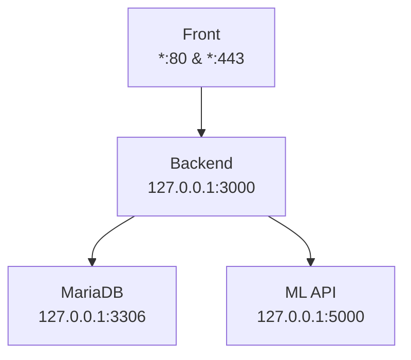

# 

# **OpenInnov G6 - Wildlens-infra**

# **Information de connexion**

- VM : `i2-openinnov-g6`
- User : `svc_adm`
- IP : `172.16.159.6`




# **Préparation**

## **Configuration réseau**

### **Désactivation IPv6**

L’IPv6 n’est pas disponible dans le labo de l’EPSI, désactiver l’ipv6 au niveau du système permet d’éviter des bugs.

```
$ sudo vim /etc/sysctl.conf
net.ipv6.conf.all.disable_ipv6 = 1
net.ipv6.conf.default.disable_ipv6 = 1
net.ipv6.conf.lo.disable_ipv6 = 1

$ sudo sysctl -p
```

### **Configuration SSH**

````
$ sudo vim /etc/ssh/sshd_config
PermitRootLogin no
PasswordAuthentication no
AllowAgentForwarding no
AllowTcpForwarding no
X11Forwarding no
PrintMotd no

$ sudo systemctl restart sshd
````

### **Installation du Firewall**

````
$ sudo apt install ufw
# Autoriser l'accès SSH depuis le réseau labo
$ sudo ufw allow from 172.16.0.0/16 to 172.16.159.6 port 22 proto tcp comment "Accès SSH depuis le Labo EPSI" 
# Autoriser l'accès SSH depuis le wifi labo
$ sudo ufw allow from 10.0.3.0/24 to 172.16.159.6 port 22 proto tcp comment "Accès SSH depuis le Wifi Labo"
$ sudo ufw enable
````

## **Téléchargement des projets**

```
$ sudo mkdir -p /app/www && cd /app/
$ sudo apt install git
$ sudo useradd --system --no-create-home --shell /usr/sbin/nologin --home-dir /app/wildlens wildlens
$ sudo chmod g+rwx /app/wildlens/
$ sudo chown wildlens: /app/wildlens/
$ cd /app/wildlens/
$ sudo -u wildlens git clone https://github.com/Leo292929/OpenInnov_Front.git front
$ sudo -u wildlens git clone https://github.com/Leo292929/OpenInnov_Back.git back
$ sudo -u wildlens git clone https://github.com/Leo292929/OpenInnov_API.git ml-api
```

# **Installation des middleware**

## **Apache2**

````
$ sudo apt install apache2
$ sudo a2enmod headers ssl proxy proxy_http
$ sudo vim /etc/apache2/conf-available/security.conf
````

````
# Changing the following options will not really affect the security of the
# server, but might make attacks slightly more difficult in some cases.

#
# ServerTokens
# This directive configures what you return as the Server HTTP response
# Header. The default is 'Full' which sends information about the OS-Type
# and compiled in modules.
# Set to one of:  Full | OS | Minimal | Minor | Major | Prod
# where Full conveys the most information, and Prod the least.
#ServerTokens Minimal
ServerTokens Prod
#ServerTokens Full

#
# Optionally add a line containing the server version and virtual host
# name to server-generated pages (internal error documents, FTP directory
# listings, mod_status and mod_info output etc., but not CGI generated
# documents or custom error documents).
# Set to "EMail" to also include a mailto: link to the ServerAdmin.
# Set to one of:  On | Off | EMail
#ServerSignature Off
ServerSignature Off

#
# Allow TRACE method
#
# Set to "extended" to also reflect the request body (only for testing and
# diagnostic purposes).
#
# Set to one of:  On | Off | extended
TraceEnable Off
#TraceEnable On

#
# Forbid access to version control directories
#
# If you use version control systems in your document root, you should
# probably deny access to their directories.
#
# Examples:
#
RedirectMatch 404 /\.git
RedirectMatch 404 /\.svn
RedirectMatch 404 /\.env
#
# Setting this header will prevent MSIE from interpreting files as something
# else than declared by the content type in the HTTP headers.
# Requires mod_headers to be enabled.
#
Header set X-Content-Type-Options "nosniff"

#
# Setting this header will prevent other sites from embedding pages from this
# site as frames. This defends against clickjacking attacks.
# Requires mod_headers to be enabled.
#
Header set Content-Security-Policy "frame-ancestors 'self';"
````

````
$ sudo vim /etc/apache2/sites-available/wildlens.conf
````

````
<VirtualHost *:80>
    ServerName wildlens.luzilab.net/
    Redirect permanent / https://wildlens.luzilab.net/
</VirtualHost>

<VirtualHost *:443>
    ServerName wildlens.luzilab.net/

    SSLEngine on
    SSLCertificateFile /etc/ssl/certs/ssl-cert-snakeoil.pem
    SSLCertificateKeyFile /etc/ssl/private/ssl-cert-snakeoil.key

    ProxyPreserveHost On

    # Proxy servant l'API de wildlens
    ProxyPass /api/ http://localhost:3000/api/
    ProxyPassReverse /api/ http://localhost:3000/api/

    # Publication du front
    DocumentRoot /app/www/
    <Directory /app/www>
        Options -Indexes +FollowSymLinks
        AllowOverride All
        Require all granted
    </Directory>
</VirtualHost>
````

````
$ sudo a2dissite 000-default.conf
$ sudo a2ensite wildlens.conf 
$ sudo systemctl restart apache2
$ sudo ufw allow from 172.16.0.0/16 to 172.16.159.6 port 443 proto tcp comment "Accès HTTPS depuis le Labo EPSI"
$ sudo ufw allow from 10.0.3.0/24 to 172.16.159.6 port 443 proto tcp comment "Accès HTTPS depuis le Wifi Labo"
$ sudo ufw allow from 172.16.0.0/16 to 172.16.159.6 port 80 proto tcp comment "Accès HTTP depuis le Labo EPSI"
$ sudo ufw allow from 10.0.3.0/24 to 172.16.159.6 port 80 proto tcp comment "Accès HTTP depuis le Wifi Labo"
````

````
$ sudo apt install certbot python3-certbot-apache
$ sudo certbot --apache -d wildlens.luzilab.net
````

## **MariaDB**

````
$ sudo apt install mariadb-server
$ sudo mariadb-secure-installation
$ sudo vim /etc/mysql/mariadb.conf.d/50-server.cnf
bind-address            = 127.0.0.1
$ sudo systemctl restart mariadb
$ vim /tmp/import.sql
````

````
drop database if exists MSPR61;
create database MSPR61;
use MSPR61;

Drop table if exists Espece;
Drop table if exists Empreinte;
Drop table if exists utilisateur;

CREATE TABLE  IF NOT EXISTS Utilisateur(
 idUser int NOT NULL AUTO_INCREMENT,
 nomUser varchar(255),
 courielUser varchar(255),
 mdpUser varchar(255),
 PRIMARY KEY(idUser)
 );
 
CREATE TABLE  IF NOT EXISTS Espece(
 idEspece int NOT NULL AUTO_INCREMENT,
 nomEspece varchar(255),
 descriptionEspece varchar(255),
 nomLatin varchar(255),
 famille ENUM('Félin','Canidé','Rongeur','Lagomorphe','Ursidé','Procyonidé'),
 taille varchar(255),
 region varchar(255),
 habitat varchar(255),
 funfact TEXT,
 PRIMARY KEY(idEspece)
 );
 
 
 CREATE TABLE IF NOT EXISTS Empreinte(
 idEmpreinte int NOT NULL AUTO_INCREMENT,
 idUser int NOT NULL,
 idEspece int NOT NULL,
 adresseImage varchar(255),
 datePhoto date,
 heurePhoto time,
 localisationempreinte varchar(255),
 PRIMARY KEY(idEmpreinte),
 FOREIGN KEY (idUser) REFERENCES Utilisateur(idUser),
 FOREIGN KEY (idEspece) REFERENCES Espece(idEspece)
 );
 
 
INSERT INTO Espece (nomEspece, descriptionEspece, nomLatin, famille, taille, region, habitat, funfact) 
VALUES  ('Castor', 'Le castor d’Europe, appelé également le castor commun ou le castor d’Eurasie, est un mammifère rongeur aquatique de la famille des castoridés.', 'Castor canadensis', 'Lagomorphe', '100 à 135 cm queue comprise', 'Europe du nord et Eurasie', 'Le castor d’Europe vit le long des rivières, des ruisseaux, des lacs et des étangs.', 'À l’exception des humains, le castor est l’un des seuls mammifères qui façonnent son environnement.'),
		('Chat', 'Le chat est un petit mammifère carnivore domestiqué, connu pour son agilité et son comportement indépendant.', 'Felis catus', 'Félin', '30 à 50 cm', 'Mondial', 'Habitats domestiques et naturels variés.', 'Les chats passent environ 70% de leur vie à dormir.'),
        ('Chien', 'Le chien est un mammifère domestiqué et un compagnon fidèle de homme depuis des millénaires.', 'Canis lupus familiaris', 'Canidé', '45 à 110 cm', 'Mondial', 'Divers habitats, souvent dans des environnements humains.', 'Les chiens ont une capacité remarquable à comprendre et à interpréter les émotions humaines.'),
        ('Coyote', 'Le coyote est un canidé de taille moyenne connu pour sa grande adaptabilité et ses hurlements nocturnes.', 'Canis latrans', 'Canidé', '75 à 100 cm', 'Amérique du Nord et Centrale', 'Prairies, forêts, montagnes et zones urbaines.', 'Les coyotes sont capables de courir à des vitesses allant jusqu\'à 65 km/h.'),
        ('Ecureuil', 'Les écureuils sont de petits rongeurs arboricoles connus pour leur habileté à grimper aux arbres et à stocker de la nourriture.', 'Sciurus vulgaris', 'Rongeur', '20 à 35 cm', 'Hémisphère nord', 'Forêts, parcs et jardins.', 'Les écureuils peuvent faire des sauts de 10 fois la longueur de leur corps.'),
        ('Lapin', 'Le lapin est un petit mammifère herbivore connu pour ses grandes oreilles et sa capacité à se reproduire rapidement.', 'Oryctolagus cuniculus', 'Lagomorphe', '30 à 50 cm', 'Europe, Asie, Afrique du Nord', 'Prairies, forêts et milieux urbains.', 'Les lapins peuvent tourner leurs oreilles à 180 degrés pour capter les sons provenant de différentes directions.'),
        ('Loup', 'Le loup est un grand carnivore de la famille des canidés. Il est connu pour sa structure sociale complexe et son intelligence.', 'Canis lupus', 'Canidé', '105 à 160 cm', 'Hémisphère nord', 'Forêts, montagnes, plaines, toundra et déserts.', 'Les loups sont capables de parcourir jusquà 80 km en une journée.'),
		('Lynx', 'Le lynx est un félin de taille moyenne connu pour ses oreilles pointues et sa fourrure tachetée.', 'Lynx lynx', 'Félin', '80 à 130 cm', 'Europe, Asie et Amérique du Nord', 'Forêts denses et montagnes.', 'Les lynx ont des touffes de poils caractéristiques sur le dessus des oreilles.'),
		('Ours', 'Lours est un grand mammifère omnivore qui habite principalement dans les régions boisées et montagneuses.', 'Ursus arctos', 'Ursidé', '150 à 300 cm', 'Hémisphère nord', 'Forêts, montagnes et toundra.', 'Les ours ont un sens de lodorat extrêmement développé, capable de détecter une carcasse à plusieurs kilomètres.'),
		('Puma', 'Le puma est un grand félin solitaire qui habite les montagnes et les forêts dAmérique.', 'Puma concolor', 'Félin', '105 à 200 cm', 'Amériques', 'Montagnes, forêts, prairies et déserts.', 'Les pumas peuvent sauter jusquà 5,5 mètres en hauteur.'),
		('Rat', 'Le rat est un rongeur omniprésent dans de nombreux habitats, y compris les environnements urbains et ruraux.', 'Rattus norvegicus', 'Rongeur', '20 à 25 cm sans la queue', 'Mondial', 'Villes, fermes, forêts, savanes et déserts.', 'Les rats ont une excellente mémoire et sont capables de naviguer dans des labyrinthes complexes.'),
		('Raton Laveur', 'Le raton laveur est un mammifère omnivore connu pour ses compétences en manipulation et ses habitudes nocturnes.', 'Procyon lotor', 'Procyonidé', '40 à 70 cm', 'Amérique du Nord', 'Forêts, zones humides, banlieues et villes.', 'Les ratons laveurs lavent souvent leur nourriture avant de la manger.'),
		('Renard', 'Le renard est un petit carnivore de la famille des canidés, reconnaissable par sa queue touffue et son comportement rusé.', 'Vulpes vulpes', 'Canidé', '45 à 90 cm', 'Hémisphère nord', 'Forêts, prairies, montagnes et déserts.', 'Les renards utilisent leurs queues comme couverture et pour se réchauffer.');

INSERT INTO Utilisateur ( nomUser,courielUser,mdpUser)
VALUES ('root','[[email protected]](https://www.notion.so/cdn-cgi/l/email-protection)','root');

SELECT * FROM Espece WHERE idEspece = 1;
SELECT * FROM Espece;
SELECT * FROM Utilisateur;
SELECT * FROM Empreinte;
SHOW tables;
````

````
$ my 
> SOURCE /tmp/import.sql;
> CREATE USER 'wildlens_back'@'localhost' IDENTIFIED BY 'my_passwd';
> GRANT ALL on MSPR61.* TO 'wildlens_back'@'localhost';
````

# **Installation des applications**

## **Installation du frontend**

```
$ cd /app/wildlens/front
$ sudo apt install nodejs npm
$ sudo -u wildlens git checkout master
$ sudo -u wildlens npm install
$ sudo -u wildlens vim src/services/api.js
const API_URL = 'https://wildlens.luzilab.net/api';
$ sudo -u wildlens npm run build
$ sudo cp -r build/* /app/www/
```

## **Installation du backend**

```
$ cd /app/wildlens/back
$ sudo -u wildlens mkdir /app/wildlens/back/uploads
$ sudo chmod 700 /app/wildlens/back/uploads/
$ sudo -u wildlens npm install
$ sudo vim /lib/systemd/system/openinnov-back.service
```

```
[Unit]
Description=OpenInnov Back
Documentation=https://github.com/Leo292929/OpenInnov_Back
After=network.target

[Service]
Type=simple
User=wildlens
Environment="DB_HOST=127.0.0.1"
Environment="DB_USER=wildlens_back"
Environment="DB_PASSWORD=my_passwd"
Environment="DB_NAME=MSPR61"
Environment="SESSION_SECRET=my_secret"
ExecStart=/usr/bin/node /app/wildlens/back/server.js
WorkingDirectory=/app/wildlens/back/
Restart=on-failure

[Install]
WantedBy=multi-user.target
```

```
$ sudo systemctl daemon-reload
$ sudo systemctl start openinnov-back
$ sudo systemctl enable openinnov-back
```

## **Installation du ML API**

```
$ cd /app/wildlens/ml-api
$ sudo apt install python3.13-venv
$ sudo -u wildlens -i
$ python3 -m venv .venv
$ source .venv/bin/activate
$ pip install -r requirements.txt
$ exit
$ sudo vim /lib/systemd/system/openinnov-ml-api.service
```

````
[Unit]
Description=OpenInnov ML API
Documentation=https://github.com/Leo292929/OpenInnov_API
After=network.target

[Service]
Type=simple
User=wildlens
ExecStart=/app/wildlens/ml-api/.venv/bin/python3 /app/wildlens/ml-api/app.py
WorkingDirectory=/app/wildlens/ml-api/
Restart=on-failure

[Install]
WantedBy=multi-user.target
````

````
$ sudo systemctl daemon-reload
$ sudo systemctl start openinnov-ml-api
$ sudo systemctl enable openinnov-ml-api
````